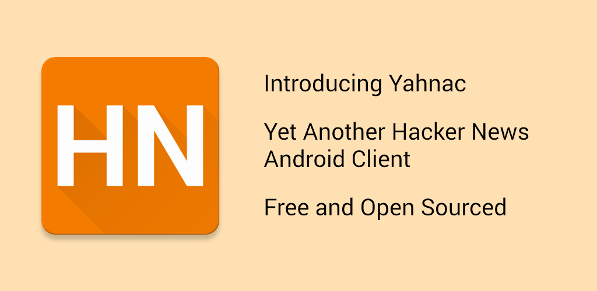

[][1]

[][1]

## Description

Yet Another Hacker News Android Client

You can use this app to keep up to date with the latest news from Hacker News:

  - Top Stories
  - New Stories
  - Best Stories
  - Show HN
  - Ask HN
  - Jobs
  - Bookmark stories: Yahnac also allows you bookmark the stories like, so you never lose track of them.

## Data source

The application is using the new [HackerNews API](https://github.com/HackerNews/API) for fetching all the stories.
Unfortunately, the API is not ready yet fetching comments properly so the solution for now is to scrape the website.

## Tests

Yahnac has tests around the parsing of Stories and Comments. You can execute them by using the new Unit Testing functionality added to Android Studio.
You can learn more about [testing](http://developer.android.com/tools/testing/testing_android.html) and [how to run them](http://tools.android.com/tech-docs/unit-testing-support)

## Links

Here are a list of useful links:

 * We always welcome people to contribute new features or bug fixes, [here is how](https://github.com/novoda/novoda/blob/master/CONTRIBUTING.md) 
 * If you have a problem check the [Issues Page](https://github.com/malmstein/yahnac/issues) first to see if we are working on it

License
-------

    Copyright 2015 David Gonzalez

    Licensed under the Apache License, Version 2.0 (the "License");
    you may not use this file except in compliance with the License.
    You may obtain a copy of the License at

       http://www.apache.org/licenses/LICENSE-2.0

    Unless required by applicable law or agreed to in writing, software
    distributed under the License is distributed on an "AS IS" BASIS,
    WITHOUT WARRANTIES OR CONDITIONS OF ANY KIND, either express or implied.
    See the License for the specific language governing permissions and
    limitations under the License.

 [1]: https://play.google.com/store/apps/details?id=com.malmstein.yahnac
